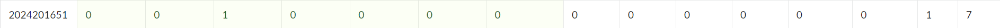

# bomblab 报告

姓名：张馨予

学号：2024201651

| 总分 | phase_1 | phase_2 | phase_3 | phase_4 | phase_5 | phase_6 | secret_phase |
| --------- | ------------- | ------------- | ------------- | ----------------- |-----------|-----------|-----------|
| 7       | 1            | 1            | 1            | 1 |1  |1  |1  |


scoreboard 截图：



## 解题报告

### phase_1

```c
Chrysanthemum, kalanchoe, become your shield whenever you fall asleep.
```

这个phase拆弹思路是将输入字符串你和程序期望得到的字符串比较，相同则拆弹成功。

根据`lea   0x1d40(%rip),%rsi     # 3180 <_IO_stdin_used+0x180>`找到phase_1答案储存的相对地址，再通过gdb打断点运行，通过真实基址加0x180计算得出答案储存地址。


### phase_2

```c
928973 493042 1409617 791988
```

这个phase拆弹的思路是计算两个矩阵的乘法，结果就是答案。

首先由于调用sscanf时读入了4个整数，所以推测答案包含4个整数，乘法计算得出的矩阵的size应为2x2。

下面观察代码模拟计算的过程，发现内层循环3次，中层循环2次，外层循环2次，推测应该是2x3和3x2的两个矩阵相乘。（就是看出这个循环层次花了些时间）

下一步需要找到两个矩阵。设置好断点运行至phase_2后运行`x/30i phase_2`命令，找出调用两个矩阵的真实地址，分别为matA `0x55555555a130`，matB `0x55555555a110`。

然后`x/9wd 0x55555555a130`查看矩阵，手算乘法结果即可。

### phase_3

```c
5 -164
```

整体思路就是输入解析 & switch-case跳转表 & 校验。

首先sscanf输入了两个数x,y。y小于0，x在0-7之间。

然后需要找到跳转表的内容。

调用`info files`找到地址`0x00005555555551e0 - 0x0000555555556e45 is .text`随后得到跳转表。

对于y，执行每个case的运算，发现只有两个case得出的-164符合要求。其余是死路或者y为0。

其实到这里范围就较小了，我先试了4 -164不对，就尝试了可能因为编号起始数字变化成为答案的5 -164，结果正确。

这个phase就是跳转表的每个phase计算容易出错，实际尝试输入了很多次。

这个phase炸了一次纯属我手欠，运行到explode_bomb断点想试试炸了会不会有记录所以打了continue，然后就成功爆炸（）

### phase_4

```c
31 BA
```

首先分析func4_1，其思路可以表示为下面这段代码：

`func4_1(int n):`
    `if n <= 0: return 0`
    `if n == 1: return n`
    `return 2 * func4_1(n-1) + 1`

且输入是5（`mov $0x5, %edi`)，递归计算可得第一个输入是31。


fuc4_2部分的答案最终是通过gdb逐步跟踪在缓冲区中找到的。

先尝试了解读代码，大概是一个走分支的思路，但没找到正确答案。然后就尝试gdb跟踪的方法。

首先在func4_2函数中的两个字符串写入的位置设置断点。然后逐步执行`stepi`，在运行到`strings_not_equal ()`时查看缓冲区的内容（运行`x/s $r9`）结果是BA。


### phase_5

```c
-12 56
```

首先看输入部分的检查，得出输入是两个数。第一个数X需要小于0，但读入X后又进行了mod16运算，然后存入X的位置。

之后需要找到一个数组array.0，使得array.0[X'+7]为15，第二个输入Y是8个元素的总和。

下面附上我的追踪过程的草稿，就可以得出答案。就是最后得到的X'=4还要减去16才能符合要求。


### phase_6

```c
5 4 3 6 2 1
```

首先读入了6个数字，需要正确匹配才能拆弹。

下一步需要了解read_six_numbers函数。发现第一重检查要求6个数在1-6之间，且必须互不相同。第二重检查需要得到链表node的内容，链表需要按value升序排列。

我在寻找node内容的过程中绕了一些路。之后使用`info registers rdx`找到了正确地址，得到node链表的内容。

最后就很简单了，根据value进行排序就可以得到答案。

# secret_phase

```c
密钥：coding 答案：ccaac
```

一开始就是毫无头绪，都不知道从哪里输入，所以先去分析fuc_7和secret_phase内容。

还是先看输入什么。

```
1b24: lea 0x4675(%rip),%rsi    # 61a0 <row0>
1b48: lea 0x4651(%rip),%rdx    # 61a0 <row0>
```

从这里找到对应密钥的相对地址，再找真实地址查看一下内容也就是coding。

接下来找在哪里输入coding。先去read_line里找，结果就没有体现secret_phase，所以往下看了一点，在phase_defused里有跳转secret_phase（其实后面看到secret_phase里面其实有调用phase_defused，所以其实可以直接去找）。

尝试在phase_defused的跳转secret_phase处打断点，但发现正常根本不会运行到那里。

之后去网上搜了篇文章得到灵感，在phase_6之后输入，终于运行到了断点，成功进入phase。

得到最后答案的过程比较顺利。总体思路就像提示词所说，这是一个在8x8棋盘上走马字的游戏。题目要求从(0,0)走到(4,7)。对应移动表中`'c' (3): X+2, Y+1; 'b' (2): X+1, Y+2; 'a' (1): X-1, Y+2;` 尝试构建路径就可以得出答案。

## 反馈/收获/感悟/总结

**这个lab是几个lab里我最喜欢的一个。**这学期所有课的众多lab里唯一一次写lab感受到了乐趣（）

不算之后写report的时间拆弹一共花了4天，这几天空闲时间基本全部用于拆弹。

做起来总体上比前面的lab更顺手，可能是因为准备期中考试过程中对汇编的复习让我能更顺利地理解phase的思路。

使用AI辅助，但做完发现答案基本都是自己算出来或找出来的，AI在过程中只是提供了思路（因为它们给出的答案往往都是错的）。

最有意思的是secret_phase的入口我找了一天。。在secret_phase尤其是read_line里寻觅了很久，要崩溃了然后联系上下文（）忽然在phase_defused里发现了线索。

主要的收获是学会使用gdb工具，比之前能看懂更多的汇编，更理解汇编语言的代码思路。

## 参考的重要资料

[CSAPP Lab2 实验记录 ---- Bomb Lab（Secret Phase彩蛋解析）_bomblab secret phase-CSDN博客](https://blog.csdn.net/qq_37500516/article/details/120903236)

当我苦恼于phase_6回车就退出了没有地方输入secret_phase的密钥时，它告诉我可以尝试在phase_6答案之后加上密钥。
